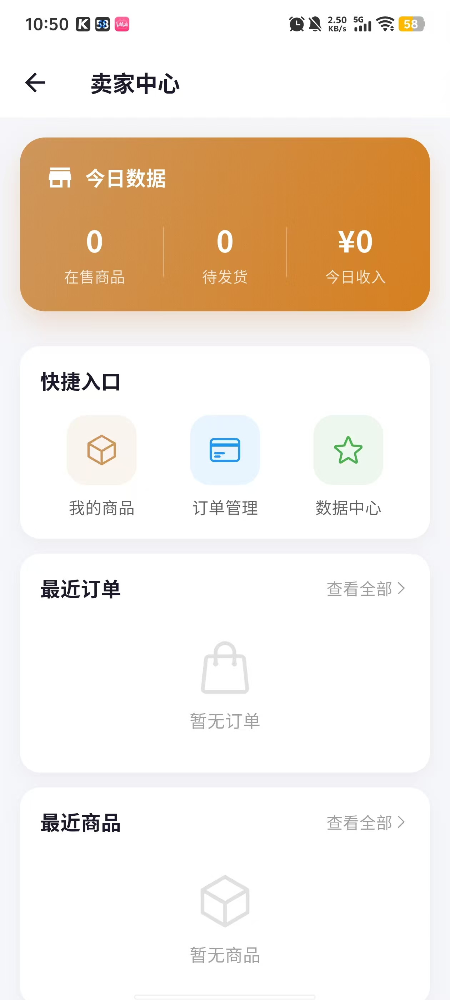
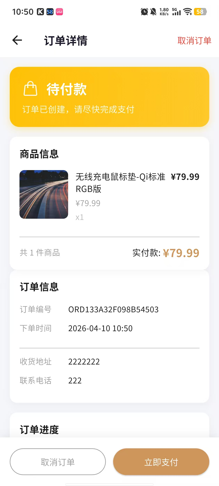

---

# 4.10 工作进度汇报：交易闭环与信息流系统升级

## 1. 核心功能更新概览

本阶段我们完成了从**商品发布、卖家管理、订单生成到消息通知**的全链路闭环开发。以下是各功能模块的详细汇报：

### 1.1 商品发布系统：支持多媒体上传

* **功能描述**：升级了商品发布接口。用户现在可以为商品上传实物照片。
* **业务逻辑**：支持自定义商品名称、分类选择、价格设定及库存管理。图片上传功能的加入显著提升了商品的展示效果，增加成交概率。

### 1.2 卖家中心：数字化经营面板

* **功能描述**：为卖家提供了直观的“今日数据”统计面板。
* **业务逻辑**：
    * **实时统计**：自动计算在售商品数、待发货订单数及今日总收入。
    * **快速入口**：集成“我的商品”、“订单管理”与“数据中心”，方便卖家快速处理经营事务。
    * **动态列表**：底部实时展示最近订单和最新上架商品，缩短管理路径。

### 1.3 订单流系统：自动化创建逻辑
**文件：** 
* **功能描述**：新增订单流转触发机制。用户在商品详情页点击“立即购买”后，系统自动进入订单详情页。
* **业务逻辑**：
    * 系统会自动生成唯一的**订单编号**并记录**下单时间**。
    * 集成收货地址与联系电话显示，并在底部提供“取消订单”与“立即支付”的交互入口。

### 1.4 订单中心：多状态可视化管理
**文件：** 
* **功能描述**：重构了“我的订单”列表页，支持按订单状态分类查看。
* **业务逻辑**：
    * **分类标签**：分为“全部、待付款、待发货、待收货”等维度。
    * **交互功能**：针对待发货订单，用户可点击“提醒发货”；针对未付订单，系统展示实付金额以便用户快速决策。

### 1.5 信息流系统：即时消息通知
**文件：** 
* **功能描述**：建立了完善的消息触达机制。
* **业务逻辑**：当订单流系统创建订单或支付成功后，系统会即时通过消息通知模块向用户推送**“支付成功”**提醒，告知用户等待卖家发货，极大优化了用户的售后心理预期。

---

## 2. 交互逻辑关系图

1.  **卖家侧**：`发布商品`-> `卖家中心`
2.  **买家侧**：`订单流` -> `信息流`-> `订单中心`。
    卖家发布商品之后可以在卖家中心查看商品数据（包括在售商品，待发货商品和今日收入等）。用户选定商品之后点击购买，系统便会自动创建订单流，然后会通过给用户发出对应的信息，告诉用户这个订单的状态，支付成功等待发货或者等待支付，同时用户可以在订单中心查看自己的所有订单。
---

