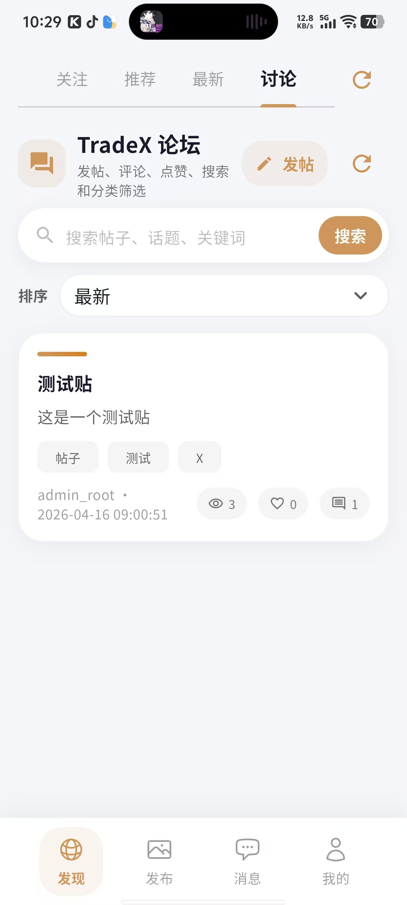
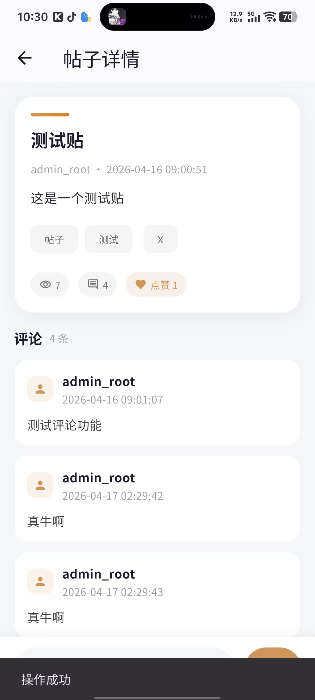
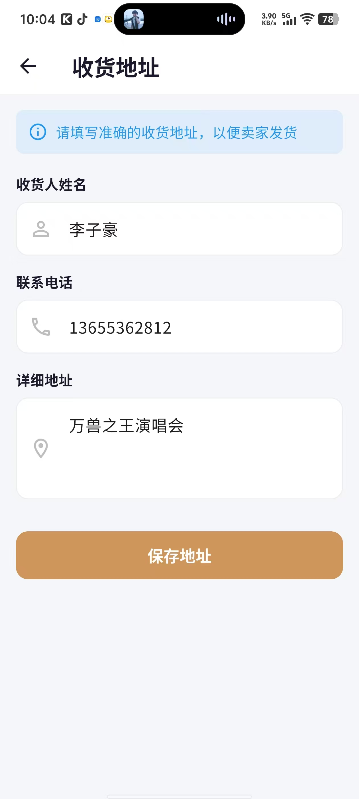
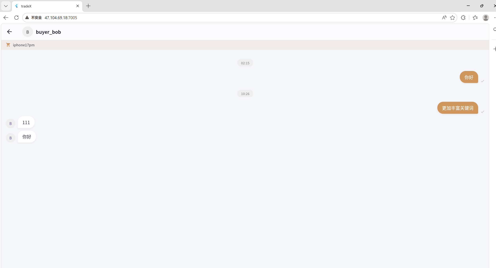

# 阶段性工作进度与功能展示报告

## 一、 本期工作概述
在本周的开发中，我们围绕**“用户社区生态建设”**与**“交易闭环体验优化”**两大板块展开，不仅全新上线了 TradeX 论坛功能以增强用户粘性，还完善了购买流程中的收货地址管理及买卖双方的实时通讯模块。

---

## 二、 核心功能详细汇报

### 1. 全新社区生态 —— TradeX 论坛功能
为打破传统商城单纯的“货架”模式，本周我们全新开发并集成了论坛板块

* **论坛主页视图**：如上图所示，论坛主页集成了全局搜索框，支持通过帖子标题、话题或关键词进行精准检索。
* **信息流展示**：在帖子列表中，直观地展示了帖子的核心数据（浏览量、点赞数、评论数），帮助用户快速筛选优质内容。

* **帖子详情与互动系统**：上图为帖子详情页。除了展示正文与标签外，我们**重点打通了“评论”与“点赞”的底层逻辑**。
    * **点赞功能**：用户可以对优质帖子进行点赞（高亮显示为“❤️ 点赞 1”），后端已实现点赞状态的防重复校验与统计更新。
    * **评论系统**：下方展示了按时间倒序排列的评论列表（如“测试评论功能”、“真牛啊”等）。该模块已完全跑通，用户可以实时发表看法，形成了良好的社区互动氛围。

---

### 2. 交易链路完善 —— 收货地址管理
为了让购买流程形成完整的闭环，我们在订单结算前置环节加入了收货地址管理模块。

* **地址信息表单**：在用户进行商品购买时，系统会强制或引导用户填写真实准确的收货信息。表单包含了标准的三要素：**收货人姓名**、**联系电话**（支持基本格式校验）以及**详细地址**（如图中的“万兽之王演唱会”测试数据）。
* **数据绑定**：填写的地址信息点击“保存地址”后，将直接与当前用户的 ID 及即将生成的订单进行一对一绑定，确保卖家发货时的信息准确无误。

---

### 3. 售前/售后保障 —— 买卖方实时通讯
电商平台中，沟通效率直接影响成单率。为此，我们开发了内嵌的即时通讯（IM）聊天界面。

* **基于订单的对话框**：当用户在浏览某件商品（例如页面左上角标明的 `iphone17pm`）并有购买意向时，可以直接发起与卖家（如 `buyer_bob`）的对话。
* **实时交互体验**：聊天界面采用了经典的左右气泡布局（气泡带有时间戳，如 `02:15`、`10:26`）。买卖双方可以在这里就商品细节、价格砍价或售后问题进行深入交流，极大地提升了平台的交易信任感与灵活性。

## 一、 本期工作概述
在本阶段的开发中，项目组主要围绕**“用户社区生态建设”**与**“交易闭环体验优化”**两大核心板块展开。我们不仅全新上线了 TradeX 论坛功能以增强用户粘性，还完善了购买流程中的收货地址管理及买卖双方的实时通讯模块。目前，各项前端页面均已实现与后端接口的联调对接。
