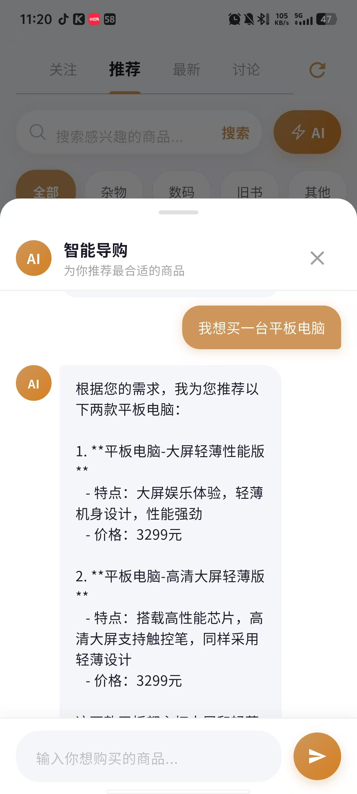
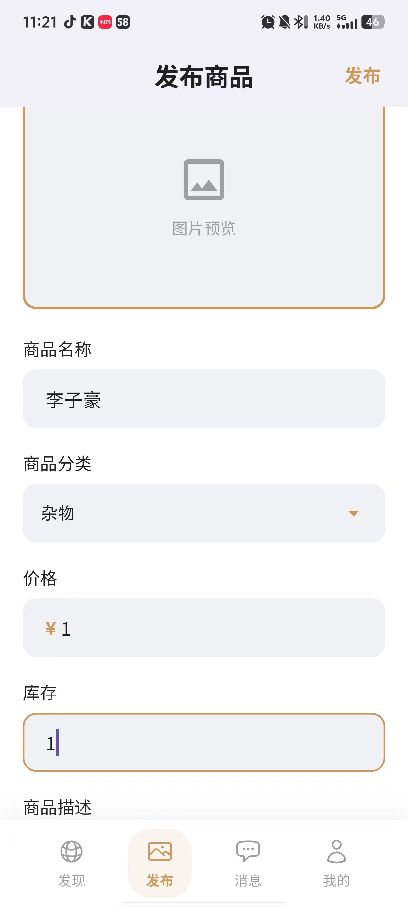
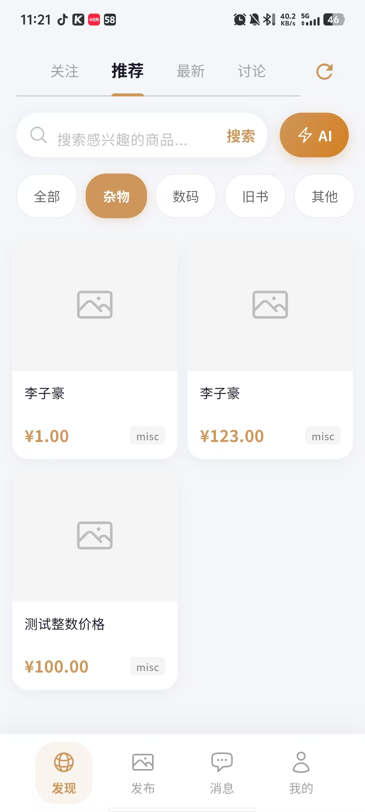
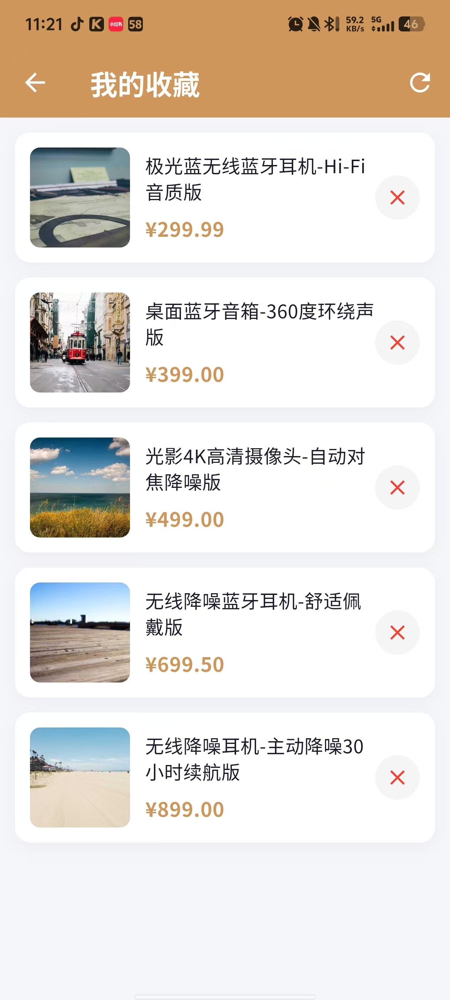
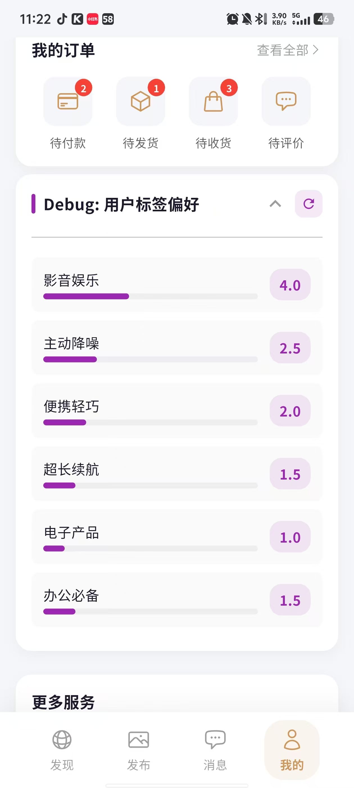

# TradeX 智能商品管理与交易系统 - 开发进度与功能展示

本项目前已完成核心的 UI 构建与多项关键交互功能。以下是当前已具备的核心功能模块详细介绍：

## 1. 首页信息流与智能分类
系统首页采用了干净整洁的瀑布流卡片设计，能够高效展示商品的主图、标题、价格及所属分类。
* **快捷导航：** 顶部提供“关注”、“推荐”、“最新”等信息流切换，并在下方设有“杂物”、“数码”、“旧等分类快捷过滤按钮。
* **AI 唤醒入口：** 搜索栏右侧配的“AI”悬浮按钮，随时引导用户体验智能化的检索服务。
* **搜索功能：** 可以在搜索栏搜索自己星耀的产品，然后系统查询后会推荐相应产品

---

## 2. AI 智能导购助手
这是本系统的核心亮点功能。打破了传统的关键词搜索模式，引入了大语言模型进行自然语言交互。
* **需求理解：** 用户可以直接输入如“我想买一台平板电脑”这样口语化的需求。
* **精准推荐：** AI 助手会结合系统内的商品库存，智能筛选并回复符合要求的商品列表。并在回复中自动提炼商品的“特点”与“价格”，极大地降低了用户的筛选成本。如用户搜索的产品系统中没有，便会推荐三个相关产品

---

## 3. 商品发布与库存管理
为商家或卖家提供了一套极简的商品上架流程。
* **发布表单：** 支持直观的图片预览上传，并可详细填写商品名称（如测试数据“李子豪”）、商品分类、价格、库存数量及商品描述。
* **实时上架：** 提交发布后，商品会立刻生成对应的展示卡片（包含占位图、标题、价格及 misc 标签），并同步至系统的商品信息流中供用户浏览。

**商品发布表单：**

**商品发布成功与列表展示：**

---

## 4. 个人收藏夹管理
帮助用户标记和追踪心仪的商品，提升最终的转化率。
* **清单管理：** 用户在浏览过程中收藏的商品会集中展示在“我的收藏”页面中。
* **便捷操作：** 列表呈现了清晰的商品缩略图和价格，同时用户可以随时清理不再需要的收藏项。

---

## 5. 用户行为画像与标签偏好 (Debug 视图)
系统底层构建了强大的用户画像引擎，用于支撑首页的个性化推荐。

* **动态偏好打分：** 如图中 `Debug: 用户标签偏好` 模块所示，系统会根据用户的浏览、点击、搜索行为，在后台自动计算并更新该用户对各类标签的偏好权重（例如：“影音娱乐 4.0”、“主动降噪 2.5”、“便携轻巧 2.0”等）。这些量化数据是实现精准推荐的核心依据。
* **订单状态概览：** 目前此功能尚未实现
