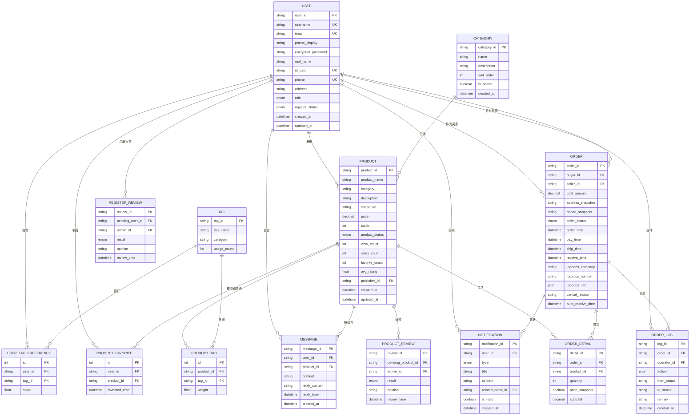

# TradeX 数据库 ER 图

## 实体关系图



## 实体详细说明

### 1. 用户相关

#### USER（用户表）
| 字段名 | 类型 | 说明 |
|--------|------|------|
| user_id | string PK | 用户唯一标识 |
| username | string UK | 用户名 |
| email | string UK | 邮箱 |
| phone_display | string | 脱敏手机号（展示用） |
| encrypted_password | string | 加密密码 |
| real_name | string | 真实姓名 |
| id_card | string UK | 身份证号 |
| phone | string UK | 手机号 |
| address | string | 地址 |
| role | enum | 角色：NORMAL/ADMIN |
| register_status | enum | 注册状态：PENDING/APPROVED/REJECTED |

### 2. 商品相关

#### PRODUCT（商品表）
| 字段名 | 类型 | 说明 |
|--------|------|------|
| product_id | string PK | 商品唯一标识 |
| product_name | string | 商品名称 |
| category | string | 分类（FK → CATEGORY） |
| description | string | 描述 |
| image_url | string | 图片URL |
| price | decimal | 价格 |
| stock | int | 库存 |
| product_status | enum | 状态：PENDING/APPROVED/OFF_SHELF |
| view_count | int | 浏览次数 |
| sales_count | int | 销量 |
| favorite_count | int | 收藏数 |
| avg_rating | float | 平均评分 |
| publisher_id | string FK | 发布者ID |

#### CATEGORY（分类表）
| 字段名 | 类型 | 说明 |
|--------|------|------|
| category_id | string PK | 分类ID |
| name | string | 分类名称 |
| description | string | 描述 |
| sort_order | int | 排序顺序 |
| is_active | boolean | 是否启用 |

### 3. 订单相关

#### ORDER（订单表）
| 字段名 | 类型 | 说明 |
|--------|------|------|
| order_id | string PK | 订单唯一标识 |
| buyer_id | string FK | 买家ID |
| seller_id | string FK | 卖家ID |
| total_amount | decimal | 订单总金额 |
| address_snapshot | string | 收货地址快照 |
| phone_snapshot | string | 联系电话快照 |
| order_status | enum | 状态：PENDING_PAY/PENDING_SHIP/SHIPPED/COMPLETED/CANCELED |
| order_time | datetime | 下单时间 |
| pay_time | datetime | 付款时间 |
| ship_time | datetime | 发货时间 |
| receive_time | datetime | 收货时间 |
| logistics_company | string | 物流公司 |
| logistics_number | string | 物流单号 |
| logistics_info | json | 物流信息快照 |
| cancel_reason | string | 取消原因 |
| auto_receive_time | datetime | 自动确认收货时间 |

#### ORDER_DETAIL（订单明细表）
| 字段名 | 类型 | 说明 |
|--------|------|------|
| detail_id | string PK | 明细ID |
| order_id | string FK | 订单ID |
| product_id | string FK | 商品ID |
| quantity | int | 购买数量 |
| price_snapshot | decimal | 下单时价格快照 |
| subtotal | decimal | 小计金额 |

#### ORDER_LOG（订单日志表）
| 字段名 | 类型 | 说明 |
|--------|------|------|
| log_id | string PK | 日志ID |
| order_id | string FK | 订单ID |
| operator_id | string FK | 操作人ID |
| action | enum | 操作类型：CREATE/PAY/SHIP/RECEIVE/CANCEL/AUTO_COMPLETE |
| from_status | string | 原状态 |
| to_status | string | 新状态 |
| remark | string | 备注 |
| created_at | datetime | 操作时间 |

### 4. 通知系统

#### NOTIFICATION（通知表）
| 字段名 | 类型 | 说明 |
|--------|------|------|
| notification_id | string PK | 通知ID |
| user_id | string FK | 接收用户ID |
| type | enum | 类型：ORDER/SYSTEM/MESSAGE |
| title | string | 标题 |
| content | text | 内容 |
| related_order_id | string FK | 关联订单ID |
| is_read | boolean | 是否已读 |
| created_at | datetime | 创建时间 |

### 5. 消息/留言系统

#### MESSAGE（商品留言表）
| 字段名 | 类型 | 说明 |
|--------|------|------|
| message_id | string PK | 留言ID |
| user_id | string FK | 用户ID |
| product_id | string FK | 商品ID |
| content | string | 留言内容 |
| reply_content | string | 回复内容 |
| reply_time | datetime | 回复时间 |
| created_at | datetime | 留言时间 |

### 6. 审核系统

#### REGISTER_REVIEW（注册审核表）
| 字段名 | 类型 | 说明 |
|--------|------|------|
| review_id | string PK | 审核ID |
| pending_user_id | string FK | 待审核用户ID |
| admin_id | string FK | 审核管理员ID |
| result | enum | 结果：PENDING/APPROVED/REJECTED |
| opinion | string | 审核意见 |
| review_time | datetime | 审核时间 |

#### PRODUCT_REVIEW（商品审核表）
| 字段名 | 类型 | 说明 |
|--------|------|------|
| review_id | string PK | 审核ID |
| pending_product_id | string FK | 待审核商品ID |
| admin_id | string FK | 审核管理员ID |
| result | enum | 结果：PENDING/APPROVED/REJECTED |
| opinion | string | 审核意见 |
| review_time | datetime | 审核时间 |

### 7. 标签系统

#### TAG（标签表）
| 字段名 | 类型 | 说明 |
|--------|------|------|
| tag_id | string PK | 标签ID |
| tag_name | string | 标签名称 |
| category | string | 标签分类 |
| usage_count | int | 使用次数 |

#### PRODUCT_TAG（商品标签关联表）
| 字段名 | 类型 | 说明 |
|--------|------|------|
| id | int PK | 自增ID |
| product_id | string FK | 商品ID |
| tag_id | string FK | 标签ID |
| weight | float | 权重 |

#### USER_TAG_PREFERENCE（用户标签偏好表）
| 字段名 | 类型 | 说明 |
|--------|------|------|
| id | int PK | 自增ID |
| user_id | string FK | 用户ID |
| tag_id | string FK | 标签ID |
| score | float | 偏好分数（0-10） |

### 8. 收藏系统

#### PRODUCT_FAVORITE（商品收藏表）
| 字段名 | 类型 | 说明 |
|--------|------|------|
| id | int PK | 自增ID |
| user_id | string FK | 用户ID |
| product_id | string FK | 商品ID |
| favorited_time | datetime | 收藏时间 |

## 关系说明

### 一对多关系（1:N）
- 一个用户可以发布多个商品 (USER → PRODUCT)
- 一个用户可以下多个订单 (USER → ORDER as buyer)
- 一个用户可以卖出多个订单 (USER → ORDER as seller)
- 一个订单包含多个订单明细 (ORDER → ORDER_DETAIL)
- 一个订单有多个操作日志 (ORDER → ORDER_LOG)
- 一个用户可以收到多个通知 (USER → NOTIFICATION)
- 一个分类下可以有多个商品 (CATEGORY → PRODUCT)

### 多对多关系（M:N）
- 商品和标签：通过 PRODUCT_TAG 关联表
- 用户和标签偏好：通过 USER_TAG_PREFERENCE 关联表
- 用户和收藏商品：通过 PRODUCT_FAVORITE 关联表

## 状态流转

### 订单状态流转
```
PENDING_PAY (待付款)
    ├── 支付完成 → PENDING_SHIP (待发货)
    └── 取消 → CANCELED (已取消)

PENDING_SHIP (待发货)
    ├── 发货 → SHIPPED (已发货)
    └── 取消 → CANCELED (已取消)

SHIPPED (已发货)
    ├── 确认收货 → COMPLETED (已完成)
    └── 自动确认 → COMPLETED (已完成)

COMPLETED (已完成) → 终态
CANCELED (已取消) → 终态
```

### 商品状态流转
```
PENDING (待审核)
    ├── 审核通过 → APPROVED (已上架)
    └── 审核拒绝 → OFF_SHELF (已下架)

APPROVED (已上架)
    └── 下架 → OFF_SHELF (已下架)

OFF_SHELF (已下架) → 终态
```

### 用户注册状态
```
PENDING (待审核)
    ├── 审核通过 → APPROVED (已通过)
    └── 审核拒绝 → REJECTED (已拒绝)

APPROVED (已通过) → 正常使用
REJECTED (已拒绝) → 需要重新提交
```
